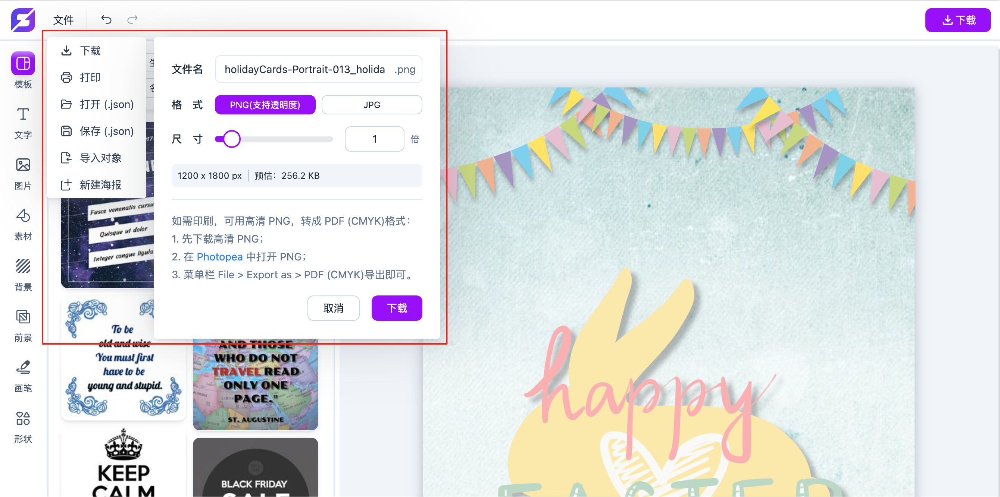
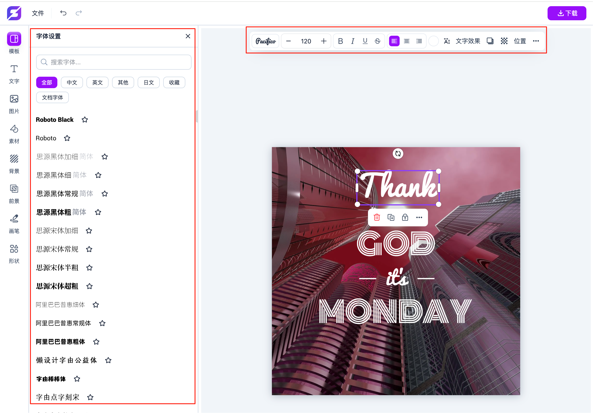
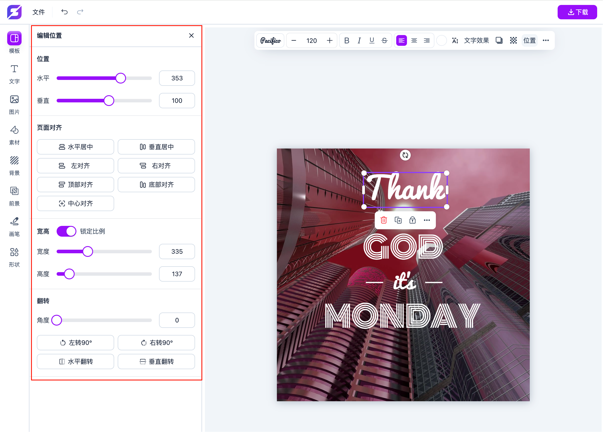
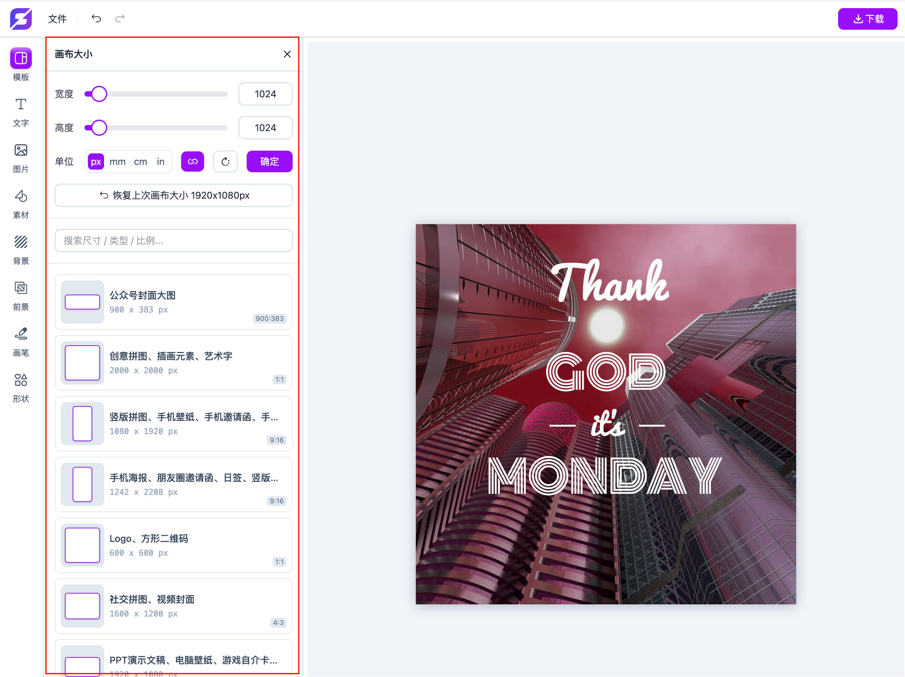
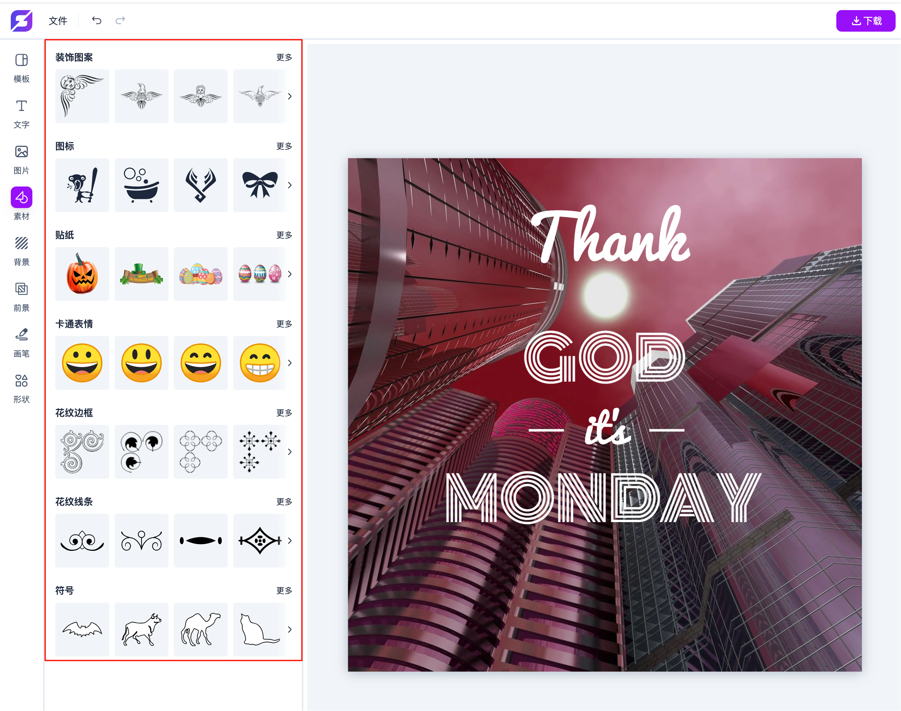
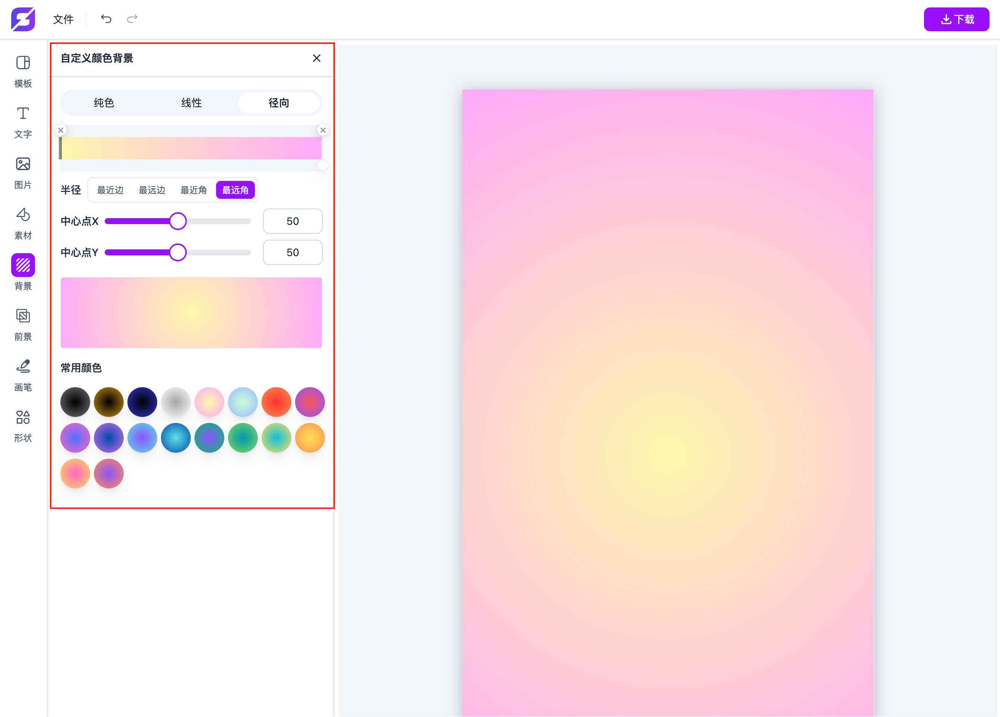
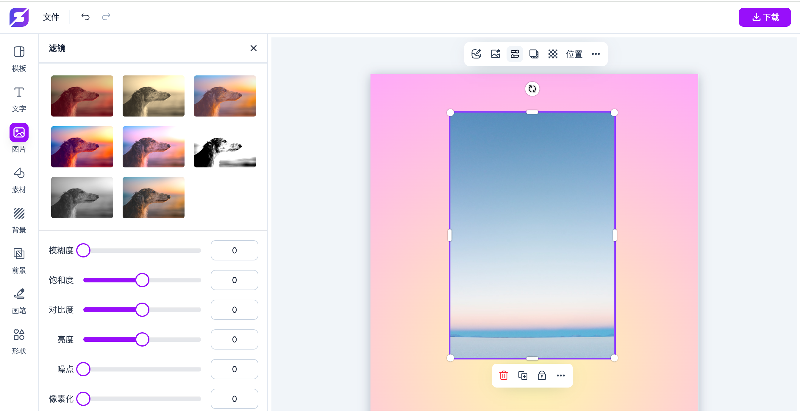

[English](https://github.com/chancedai/chancedai/blob/main/README-en.md) | 中文

<p align="center">
  <a href="https://xiaomingyan.com/v/design/" target="_blank">
    
  </a>
</p>

# Fabric Design Editor

**Fabric Design Editor** is an open-source personal project inspired by popular online design tools like Canva, Crello, and PosterMyWall.  
Originally built with **Fabric.js** and Vanilla JavaScript, it has been refactored using **Vite** and **Tailwind CSS** for easier learning and experimentation.

> ⚠️ This project has never been officially launched and is intended for learning and technical reference only.  
> ⚠️ APIs for images, backgrounds, and other Unsplash-based resources are not included — you need to implement or remove them yourself.

---

## ✨ Features

- ✅ Import, export, and save poster JSON data
- ✅ Export high-resolution images (PNG / JPG)
- ✅ Customize templates, fonts, backgrounds, foregrounds, SVG elements, and more
- ✅ Multiple brush tools: pencil, crayon, ink pen, marker, and pattern brushes
- ✅ Various basic shapes: live stream icon, arrows, rectangles, circles, ellipses, triangles, stars, hearts, and polygons
- ✅ Rich color rendering: solid colors, linear gradients, radial gradients (applied to text, backgrounds, borders, etc.)
- ✅ Text styling: bold, italic, underline, strikethrough, alignment, letter spacing, line height, etc.
- ✅ Text effects: stroke, fill, shadow, warp, and distort
- ✅ Full layer management and layer operations
- ✅ Undo/redo, right-click context menu, and keyboard shortcuts
- ✅ Object alignment, group/ungroup, delete, clone, flip, and copy styles

---

## 🚀 Getting Started

> Make sure you have **Node.js** and **npm** installed.

```bash
npm install
npm run dev
```

## 🙋 Developer Contact

For technical discussions or collaboration, feel free to reach out via WeChat (responses not guaranteed):


---

## 📄 License

This project is open-sourced under the **MIT License**.  
Feel free to learn from or modify it, but please do not use it for illegal purposes.

---

## 📂 Project Structure

```bash
├── v/design/           # Source code directory
├── package.json        # Project configuration
├── tailwind.config.js  # Tailwind CSS config
├── vite.config.js      # Vite config
└── README.md           # Project documentation
```

📸 Screenshots
Here are some screenshots showing parts of the editor’s interface and features:

 <br/>  <br/>  <br/>  <br/>  <br/>  <br/>  <br/>  <br/> 