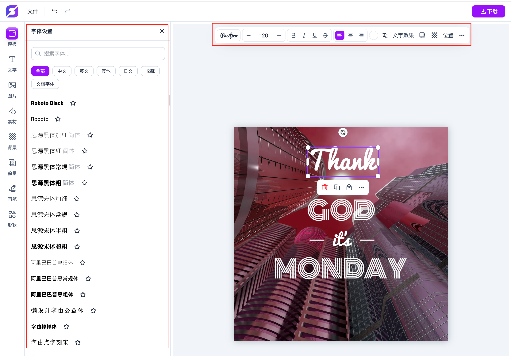
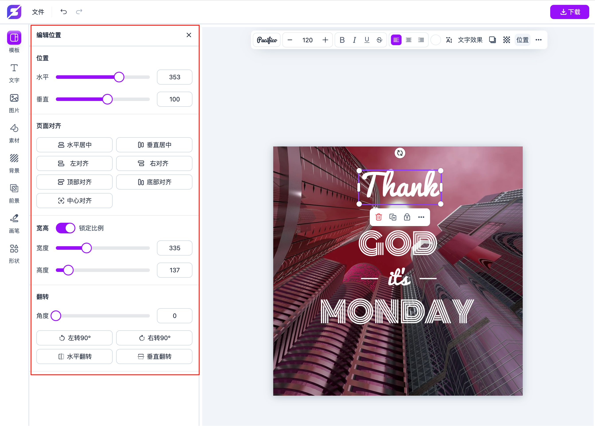
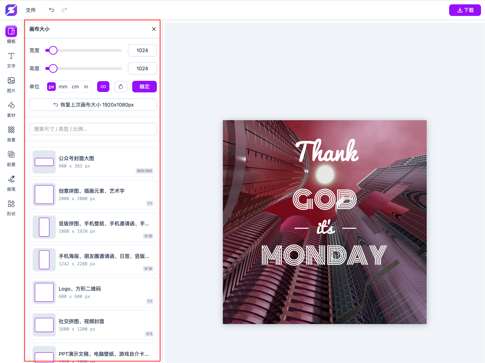
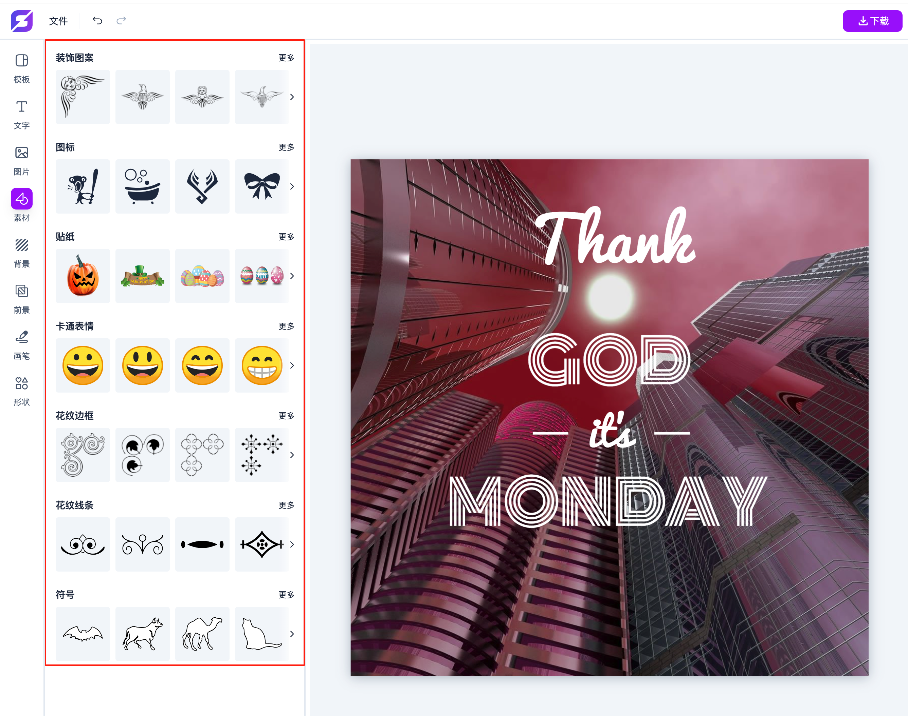
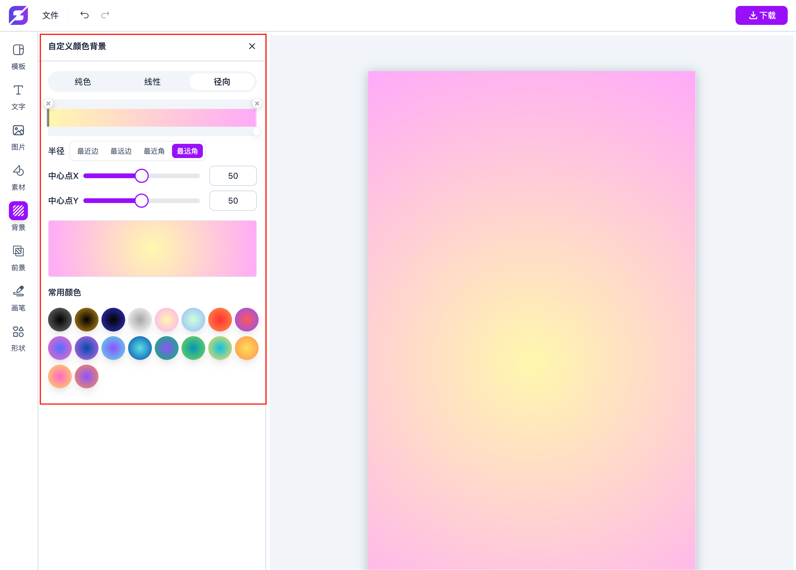
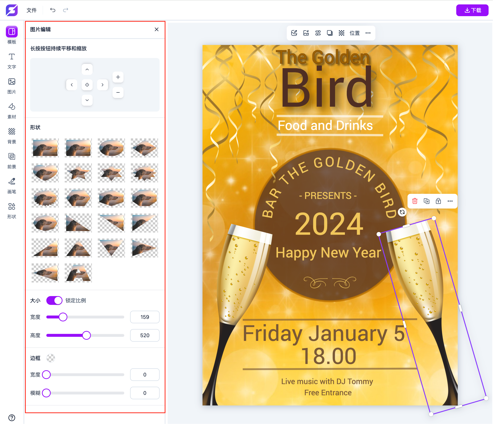

[English](https://github.com/chancedai/fabric-editor/blob/main/README-en.md) | 中文


<p align="center">
  <a href="https://xiaomingyan.com/v/design/" target="_blank">
    
  </a>
</p>


# 智绘图片编辑器

**智绘图片编辑器** 是一个个人开源项目，灵感来自 Canva、创客贴、稿定设计等在线图片编辑器。  
原版基于 **Fabric.js** 和原生 JavaScript 开发，现已简单重构，集成 **Vite** 和 **Tailwind CSS**，供学习与参考。

> ⚠️ 本项目长期未上线，仅供技术交流与学习参考。
> ⚠️ 图片、背景和前景等 unsplash 接口需要自己实现或者删除。

---

## ✨ 功能特色

- ✅ 海报 JSON 数据的导入、导出与保存
- ✅ 超高清 PNG / JPG 图片导出
- ✅ 支持自定义模板、字体、背景、前景、SVG 等素材
- ✅ 多种画笔：铅笔、蜡笔、墨水笔、马克笔、图案笔刷
- ✅ 各类基本图形：直播图标、箭头、矩形、圆形、椭圆、三角形、星形、心形、多边形
- ✅ 灵活的颜色渲染：纯色、线性渐变、径向渐变（支持文字、背景、边框等）
- ✅ 字体样式：加粗、斜体、下划线、删除线、对齐、字间距、行间距等
- ✅ 文本效果：描边、填充、投影、弯曲、变形等
- ✅ 图层管理与图层操作
- ✅ 支持撤销、重做、右键菜单、快捷键操作
- ✅ 对象对齐、组合与拆分、删除、克隆、翻转、样式复制等操作

---

## 🚀 快速开始

> 请确保你已安装 **Node.js** 和 **npm**。

```bash
npm install
npm run dev
```

## 🙋 开发者联系

如有技术交流或合作意向，可通过微信联系（精力有限，回复不保证）：


---

## 📄 开源许可

本项目基于 **MIT 协议** 开源，欢迎学习与二次开发，但请勿用于非法用途。

---

## 📂 项目结构

```bash
├── v/design/           # 源码目录
├── package.json        # 项目配置
├── tailwind.config.js  # Tailwind 配置
├── vite.config.js      # Vite 配置
└── README.md           # 项目说明文档
```

## 📸 部分功能截图


<br/>

<br/>

<br/>

<br/>

<br/>

<br/>

<br/>

<br/>

